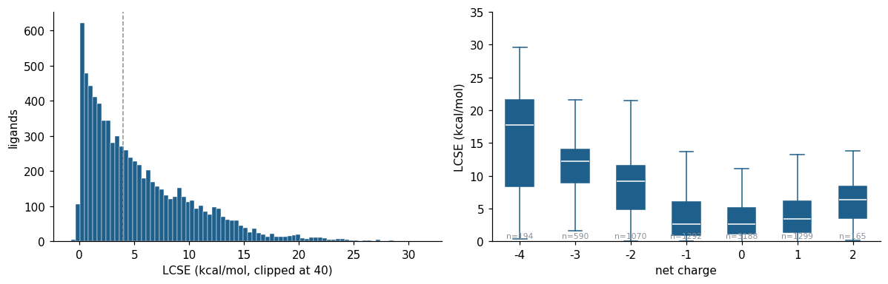

# Dataset

7887 ligand instances from [LigBoundConf](https://doi.org/10.1021/acs.jcim.0c01197) (Tong and Zhao, 2021), each with a PDB-deposited bound pose. Ligands containing elements outside the AIMNet2 set (H, B, C, N, O, F, Si, P, S, Cl, As, Se, Br, I) were excluded. Protonation and tautomer states are those of the deposited structures and are identical for both endpoints of every ligand.

## Files

| file | content |
|---|---|
| `data/lcse_master_table.csv` | one row per ligand instance: identifiers, SMILES, net charge, descriptors, PDBe annotations, AIMNet2-CPCM energies of both endpoints, LCSE, MMFF94 strain |
| `data/bound_conformers.sdf.gz` | deposited pose after relaxing bond lengths and angles with all rotatable-bond dihedrals fixed |
| `data/global_conformers.sdf.gz` | lowest-energy AIMNet2-CPCM conformer of up to 5000 Omega conformers, optimized in CPCM water |
| `data/mmff94_strain_all.csv` | MMFF94 strain, single point and re-optimized, all ligands |
| `data/gaff2_obc2_subset.csv` | GAFF2 strain in vacuum and in OBC2 implicit solvent, 50-ligand stratified subset |
| `data/conformer_count_stats.csv`, `data/timing/` | conformer-generation statistics and timing benchmarks |

Ligand IDs have the form `<ligand code>_<PDB id>_<chain>_<residue number>`; `global_pair` links instances of the same chemical species. SD tags on every conformer: `energy_hartree` (4-member ensemble mean), `final_fmax_eV/A`, `model_name`. Atom order differs between the bound and global files for the same ligand.

## Composition

| | count |
|---|---|
| ligands | 7887 |
| annotated as cofactor | 304 |
| with an enzyme-class annotation (non-cofactor) | 5247 |
| chemical species present in more than one entry | 691 |
| neutral / ±1 / \|q\| ≥ 2 | 3188 / 2591 / 2108 |

## Caveats

- Values at net charge −3 and −4 are upper bounds: continuum solvation over-stabilizes compact polyanion conformers. Sixteen of the 17 ligands above 25 kcal/mol are nucleotide di- and triphosphates or other polyanions.
- Bound-state energies inherit the crystallographic torsions; individual values carry the refinement uncertainty of the deposited pose and are best read in aggregate.
- The reference level (B97-3c/CPCM) has conformational-energy errors of 1 to 2 kcal/mol for flexible charged molecules.
- MMFF94 re-optimized strain is a local force-field strain (global endpoint relaxed from the AIMNet2-CPCM minimum, not from an independent search).
