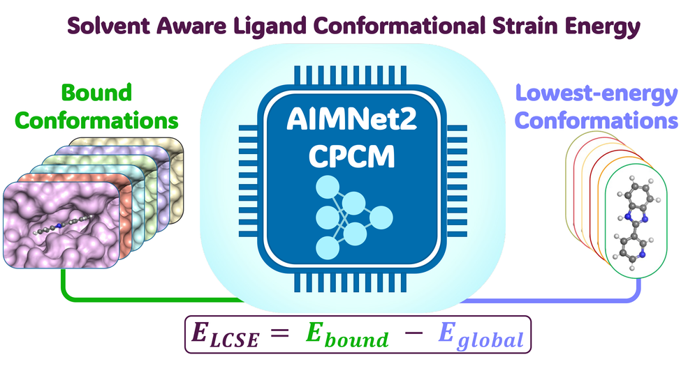

<p align="center"></p>

**Ligand conformational strain energy (LCSE)** is the energy a ligand pays to adopt its protein-bound conformation. Routine estimates reference a single gas-phase minimum, which collapses charged ligands into compact, intramolecularly hydrogen-bonded conformers and inflates their strain. **AIMNet2-CPCM** is a neural network potential trained to B97-3c energies and forces in CPCM water that treats neutral and charged species consistently, so the unbound reference can be a *solvated* global minimum found over thousands of conformers per ligand on a GPU.

This site accompanies

> H. Gokcan, O. Isayev. *Efficient and Accurate Ligand Strain Calculations in Solution with the AIMNet2 Neural Network Potential.* J. Chem. Inf. Model. 2026. [DOI to be added]

[Dataset](dataset.html) · [Method](method.html) · [Results](results.html) · [Reproduce](reproduce.html) · [GitHub](https://github.com/isayevlab/ligand-strain-aimnet2)

## What is released

| | |
|---|---|
| **Dataset** | solvated LCSE for 7887 PDB ligand instances from LigBoundConf, with the torsion-constrained bound conformer and the solvated global minimum of each, descriptors, PDBe annotations, and MMFF94 / GAFF2 comparison values |
| **Model** | the AIMNet2-CPCM TorchScript ensemble (4 members, 14 elements, neutral and charged molecules) with an ASE calculator |
| **Code** | reference implementation of the strain protocol, the analysis notebook behind the paper's figures, and the scripts for every Supporting Information table |

## Three numbers

- **4.0 kcal/mol**: median solvated strain across 7887 ligands (2.7 for neutral, 9.1 at net charge −2, 12.2 at −3).
- **7.5 kcal/mol**: median range of strain of the *same* ligand across the different targets that bind it (48 ligands with ≥ 10 entries). Strain is a property of the pose, not of the molecule.
- **22.7 conformers per second**: batched AIMNet2-CPCM optimization throughput on one NVIDIA L40S; the 8.2 million conformers of this work cost about 100 GPU-hours.

## Quick start

```bash
pip install git+https://github.com/isayevlab/ligand-strain-aimnet2.git
```

```python
from lcse import load_master_table
df = load_master_table()
df.groupby("net_charge").lcse_kcal.median()
```

Code is MIT-licensed; data are CC BY 4.0; model weights will be released with the published paper.
