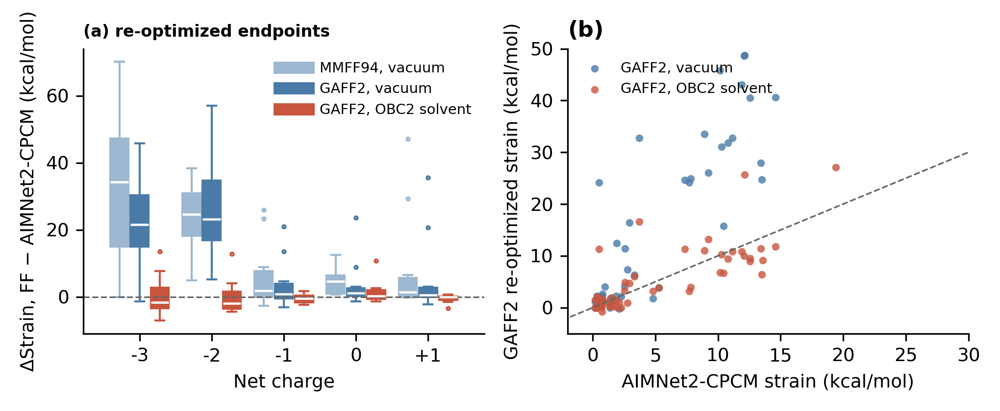

# Method

## AIMNet2-CPCM

Same architecture and training geometries as the gas-phase AIMNet2 models (~20 M structures spanning neutral and charged organic chemical space), with reference energies and forces recomputed with **B97-3c** (B97 GGA, def2-mTZVP, D3(BJ), short-range bond correction) in **CPCM water** (ε = 80) with ORCA 5.0.3. Four networks form an ensemble; long-range Coulomb (from predicted, charge-equilibrated partial charges) and D3 dispersion are part of the model graph. Elements: H, B, C, N, O, F, Si, P, S, Cl, As, Se, Br, I.

Benchmarks (paper, Figure 2): solvation energies of FreeSolv molecules from the gas and CPCM models; single-point energies of the LigBoundConf bound and global conformers, RMSE 1.2 and 1.8 kcal/mol; LCSE against B97-3c/CPCM, R² 0.90, RMSE 1.35 kcal/mol.

## Strain protocol

```
LCSE = E(bound, torsion-constrained relaxation) − E(global minimum in CPCM water)
```

1. **Bound state.** The deposited pose is relaxed with every rotatable-bond dihedral frozen at its crystallographic value; bond lengths and angles relax, so refinement noise in the high-frequency coordinates is removed while the torsional conformation imposed by the pocket is kept.
2. **Unbound state.** Up to 5000 conformers per ligand from OpenEye Omega (default search force field `mmff94smod_NoEstat`, no solvation, no electrostatics; energy window 999 kcal/mol, RMSD schedule 0.2 to 0.8 Å, hydrogen sampling on), every conformer optimized with AIMNet2-CPCM in a batched GPU optimizer, lowest energy taken. 8.16 million conformers in total (median 644 per ligand; 2.8% of ligands reached the cap).
3. Both endpoints are evaluated in CPCM water at the same protonation state. The bound-state energy in water is a defined convention, not a model of the pocket.

The reference implementation in `lcse/strain.py` reproduces this for one ligand with ASE (ETKDG conformers instead of Omega).

## Why solvation matters

Gas-phase methods, force fields and gas-phase potentials alike, collapse charged unbound conformers into intramolecularly hydrogen-bonded or salt-bridged minima. This deflates the reference and inflates the apparent strain. Adding a continuum solvent to a force field (GAFF2/OBC2) removes most of the charged-ligand discrepancy, which confirms the mechanism; the residual difference from AIMNet2-CPCM is the accuracy a QM-quality potential adds.



## Cost

| | per conformer | 8.16 M conformers |
|---|---|---|
| AIMNet2-CPCM, batched L-BFGS (SaddleForge), one L40S, batch 512 | 22.7 conformers/s | ~100 GPU-h |
| AIMNet2-CPCM forward pass, batch 256 | 10 500 conformer-steps/s (~240× one CPU core) | |
| AIMNet2-CPCM, unbatched, 1 CPU thread (not the intended platform) | 3.0 s (one member); 11.6 s (ensemble) | ~6800 CPU-h |
| AIMNet2-CPCM, unbatched, one L40S (launch-bound) | 3.7 s (ensemble) | ~8400 GPU-h |
| GFN2-xTB/ALPB, 1 CPU thread | 7.7 s | ~17 000 CPU-h |
| MMFF94, 1 CPU thread | 0.05 s | ~110 CPU-h |

Unbatched GPU execution is launch-bound (a factor of 3 over the CPU, not 240); batching is what makes the method fast. Forward-pass throughput on one L40S versus batch size (conformer-steps per second, single member / four-member ensemble): 10 550 / 2490 at batch 256, 8550 / 2130 at 512, 6510 / 1620 at 1024, 3890 / 970 at 2048; the decline with batch size comes from padding to larger molecules, so the GPU is saturated from batch 256. Details in Tables S3 and S6 of the paper and in `data/timing/sunspear/`.
