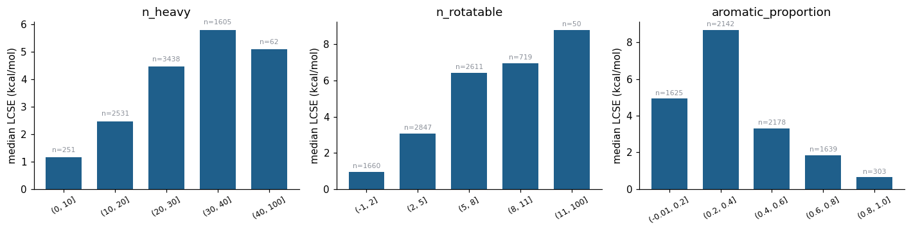
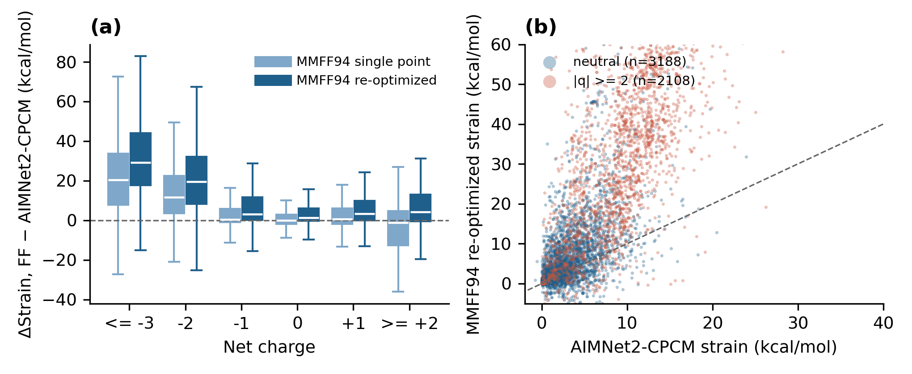
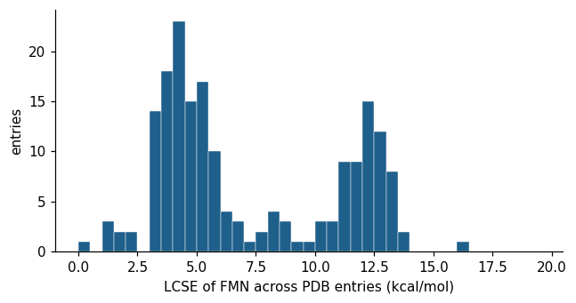

# Results

## Strain rises with net charge, asymmetrically

Median LCSE: 2.7 kcal/mol for neutral ligands, 3.4 at +1, 6.3 at +2, but 2.6 at −1, 9.1 at −2, 12.2 at −3 and 17.7 at −4 (the last two are upper bounds). Highly charged ligands can afford larger strain because the pocket repays it with salt bridges and metal coordination of phosphate groups, and because their solvated minimum is extended while the bound pose is often compact.

## Strain accumulates over many small torsional changes

LCSE correlates with the number of rotatable-bond dihedrals that change by more than 30° between the bound and global conformers (Spearman 0.57) but only weakly with the largest single change (0.11). Design should reduce overall flexibility rather than fix one rotor.

## Not an artifact of crystal quality

No correlation of LCSE with resolution (Spearman 0.05) or EDIAm (0.06). The four-member ensemble spread is 0.48 kcal/mol (median), 12% of the median strain.

## Force fields

MMFF94 single points on the same conformers agree with AIMNet2-CPCM for neutral ligands (median absolute difference 2.2 kcal/mol, no bias) and overstate charged strain by 11.6 kcal/mol at −2 and 20.3 at −3. Re-optimizing both endpoints on MMFF94 widens the gap (19.6 and 29.2). GAFF2 in vacuum behaves the same; GAFF2 with OBC2 solvent brings the bias to −1.9 and −1.7 kcal/mol.

## Enzyme classes

Ligands of transferases, oxidoreductases and hydrolases have median LCSE below 4 kcal/mol; isomerases (6.3), lyases (7.5) and ligases (7.9) are higher because they disproportionately bind ATP and other charged nucleotide phosphates. The pattern reflects chemotype, not enzyme class.

## The same ligand strains differently in different pockets

Among 48 ligands present in at least ten PDB entries, the within-ligand range of LCSE has a median of 7.5 kcal/mol and one third span more than 10 kcal/mol. FMN is bimodal across 186 entries (modes near 4.4 and 12.2 kcal/mol), with the low-strain poses sharing one isoalloxazine orientation. A single strain value is not a transferable descriptor of a compound.

